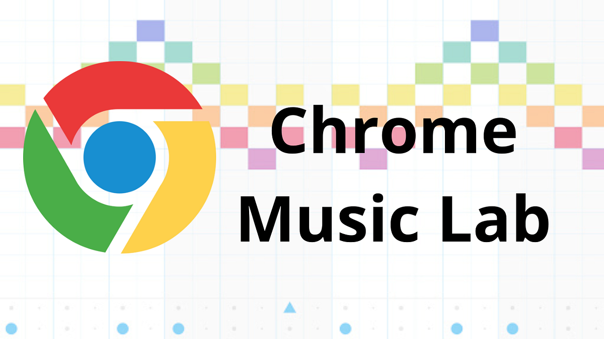
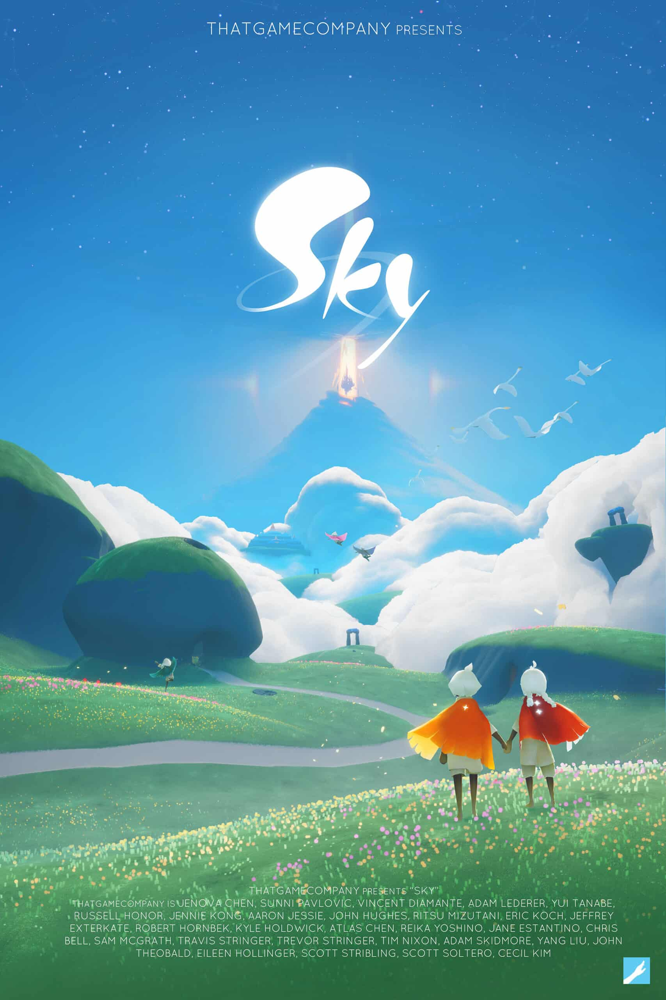

# The Process Journal

---

## Entry #1 – 03/09/2025: Finalised Idea

So I have a finalised idea. It took a little while but I got it.

### Gesture Garden 🌿💫
**Where every gesture blooms**

**Short Description**  
A collaborative digital garden where gestures bring forth sounds, images, and animations. Play together, create together, and watch the garden bloom. This is not regular social media — it's an emergent, group experience.

**How It Works (Core Features)**

**Shared Media Canvas**
- Grid of sounds, images, and videos visible by all users

**Gesture-Based Interaction**
- Swipe, tilt, or drag to reposition objects or trigger effects
- Optional webcam gestures to vote or highlight as a group

**Emergent Group Dynamics**
- New patterns, music, animations, or light effects emerge from combined gestures

**Context Awareness**
- Wall reacts differently based on number of users, strength of gesture, or time of day

**What Makes it Unique & Fun**
- Begins in a playful spirit of collaboration — users discover how to interact naturally, like in *Sky: Children of the Light*
- Emphasizes emotion, interaction, and creativity over likes, comments, or posts
- Visually engaging and demoable for presentations

**Why It’s Doable (MVP)**
- Web app created with HTML/CSS/JS
- Gesture detection using DeviceOrientation, touch events, or optional MediaPipe Hands
- Free preloaded media (videos, images, sound bites)
- Works for 1–3 users to start — solo demoable if needed

**Who Might Join / Help**
- People interested in interactive media, animation, or JS programming
- Anyone curious about playful, social tech collaboration

**Notes & Reflection**  
This project was uploaded to Padlet for collaboration. After consultation, I want to get as much data as possible in the interaction.
- Make a canvas based on the user’s environment
- List sensors and interactions
- Plan design and architecture
- Enable multiple users to interact

Considering a pivot to a **screen with lines that make sounds** based on environmental data (weather, wind, movement) transformed into music depending on how the user holds or moves their phone.

---

## Entry #2 – 10/09/2025: Sensor Research + Concept Refinement

After defining my initial idea, I explored how sensors and contextual inputs could shape the experience.

**Possible Sensors and Data Inputs**
- **Accelerometer** – detects shaking/motion; plants bloom or lines bend/react
- **Gyroscope** – tilt and rotation; for canvas panning or sound pitch
- **Touch Events** – swipes, drags, multi-touch; planting seeds vs stretching lines
- **Microphone** – captures ambient noise; triggers reactive blossoms or textures
- **GPS / Location** – context-aware garden or soundscapes unique to location
- **Weather API** – seasonal themes or sound characteristics
- **Light Sensor** – brightness shifts; glowing night garden or pulsing lines
- **Webcam (optional)** – group gestures (waving, drawing lines with hands)

**Feasibility (Web App Context)**
- Straightforward: Accelerometer, gyroscope, touch, microphone
- Possible: GPS + weather APIs
- Challenging: Light sensor, webcam (needs MediaPipe)

> For MVP, focus on motion (accelerometer/gyroscope) + touch. Microphone optional, weather/location for depth but not essential.

**Environmental Context Possibilities**
- Day vs Night: colors and sounds shift tone
- Weather: sunny = warm visuals, rainy = softer notes
- Windy: faster movement (flowers sway, lines ripple)
- Noise Levels: busier environment = chaotic growth or denser soundscape

**Concept Comparison**

**Gesture Garden**
- Collaborative, metaphorical garden
- Strong metaphor, intuitive, visually engaging
- Technically complex, especially multiplayer/emergent behaviors

**Sound Lines**
- Abstract reactive lines generating sound/music
- Simpler to prototype, strong responsive design tie
- Less visually rich, experimental

**Reflection**  
Both ideas are viable. Gesture Garden = collaboration/metaphor. Sound Lines = abstract sound-visual play. Leaning toward Sound Lines for feasibility but keeping both alive.

**Next Steps**
- Experiment with motion + sound in JavaScript
- Research Patatap, Google Music Lab, Sky
- Decide Gesture Garden, Sound Lines, or hybrid next entry

---

## Entry #3 – Week 3 – 12/09/2025: Related Projects + Inspirations

To refine ideas, I explored interactive art and sound projects.

### Patatap (2014)

- Web-based audiovisual experience; each keyboard press = unique sound + visual
- Admire: immediacy, no learning curve
- Difference: fixed to keyboard input; my project emphasizes body movement, sensors, environment

### Google Music Lab

- Browser-based interactive music tools (Kandinsky, Song Maker, Rhythm)
- Admire: clean, playful, educational
- Difference: my project is expressive play, less educational

### Sky: Children of the Light (2019)

- Social adventure with collaborative gestures, light, music
- Admire: emotional atmosphere, universal gesture language
- Difference: browser-based, small-scale, inspired by gesture/atmosphere

**Reflection on Human + Cultural Factors**  
People like interactive artworks that:
- Feel immediate and rewarding
- Encourage creative self-expression
- Tap shared emotions

My projects:
- Gesture Garden = shared metaphor of growth/collaboration
- Sound Lines = universal language of movement + sound

**Next Steps**
- Prototype motion-to-sound sketch in JS
- Explore hybrid garden + sound-reactive lines
- Document concept strength after trials

---

## Entry #4 – Week 4 – 14/09/2025: Technical Feasibility + Architecture Sketch

**System Flow (Draft Architecture)**

User → Input (sensors/gestures) → Processing Layer → Output (sound + visuals) → Shared Canvas

**Input (Sensors + Gestures)**
- DeviceOrientation API (tilt, rotation)
- Touch + drag gestures
- Microphone input (optional)
- External data (Weather API, GPS)

**Processing Layer**
- JS functions map gestures → musical notes, line movement, or visual growth
- Contextual modifiers (sunny = bright visuals, windy = fast oscillations)
- Scaling rules for rewarding gestures

**Output**
- Visuals: animated lines, shapes, blooms
- Audio: Web Audio API for synthesis and triggering
- Shared Canvas: multi-user layering

**Networking (Optional MVP)**
- Phase 1: Single-user demo
- Phase 2: Real-time multiplayer via WebSockets
- Phase 3: Collaborative persistence

**Diagram (Simplified)**

[ User Device ]
↓ sensors/gestures
[ Input Capture Layer ]
↓ (tilt, swipe, mic, GPS, weather)
[ Processing Engine (JS) ]
↓ mapping rules
[ Output Layer ]
→ visuals on canvas
→ sounds via Web Audio API
→ (optional) multiplayer sync via WebSockets

**Must-Have MVP Features**
- Line animations respond to tilt + swipe
- Sound output mapped to gestures
- Contextual change based on environment (time/weather)
- Single-user demo

**Future Enhancements**
- Multiplayer
- Webcam/hand-tracking via MediaPipe
- Long-term persistence
- Complex visuals (particle effects, 3D)

**Reflection**  
Focus on clarity/playability first. Even a single-device reactive system feels magical. Browser APIs provide sensors, audio, canvas; the challenge is intuitive, rewarding design.

---

## Entry #5 – Week 5 – 17/09/2025: Interaction Design & User Scenarios

**User Interaction Sketches**
- **Sound Lines:** tilt/swipe/drag lines, each with tone/volume/pitch; lines bend/stretch/ripple
- **Gesture Garden:** plant/grow flowers; microphone triggers reactive animations

**Typical Gestures & Expected Responses**

| Gesture/Input  | Sound Lines Response                 | Gesture Garden Response                  | Environmental Modifiers                     |
|----------------|-------------------------------------|-----------------------------------------|--------------------------------------------|
| Swipe left/right | Lines slide horizontally; pitch shifts | Seeds shift; small petals appear         | Windy = lines ripple faster; sunny = brighter colors |
| Tilt device     | Lines bend                          | Flowers lean/sway                        | Night = glow softly; day = vibrant colors |
| Tap             | Trigger note/chord                  | Plant seed / activate bloom              | Rain = drops sound; noisy = denser growth |
| Shake device    | Lines vibrate/staccato notes       | Rapid growth; petals scatter             | Stronger effect if ambient sound is high |

**Mini User Stories**
1. **Solo Play – Sound Lines:** Maya tilts phone, blue line ripples, soft descending notes, environment alters visuals with raindrops.
2. **Solo Play – Gesture Garden:** Alex claps, bloom springs up, swipes/tilts guide growth, colors shift based on device orientation/time.
3. **Collaborative Play:** Two users on same canvas; one stretches lines, other tilts for pitch; emergent harmonic patterns. In Gesture Garden, one plants, one helps grow; play co-created soundscapes.

**Reflection**
- Gestures + environmental context = embodied experience
- Solo vs collaborative play: introspection vs emergent creativity
- Guides future sensor/visual choices for MVP

---
